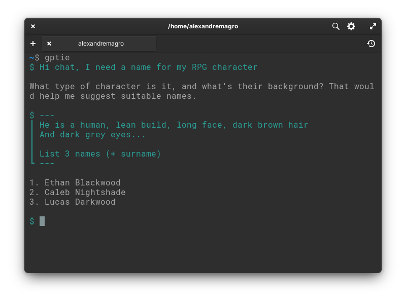
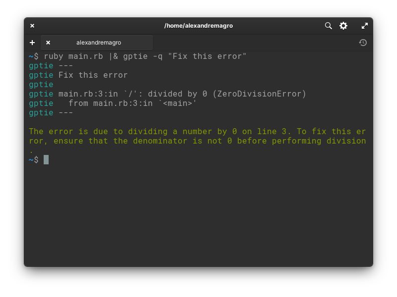

<p align="center">
  

</p>

<p align="center">
  An user-friendly command-line client for the ChatGPT.
</p>


## Installation

- Install:

```shell
npm install -g gptie
```

- Generate the API key from the OpenAI dashboard
- Set the API key as the `OPENAI_API_KEY` environment variable

## Basic Usage

Just type, use `---` delimiter to write multiple lines, and `Ctrl-C` to exit.

<p align="center">
  
</p>

## Advanced Usage

Redirect `stdout` or `stderr` with pipe (`|`), and preprend a message with argument `-q`.

<p align="center">
  
</p>

## Arguments

- `-h`, `--help` - Show help
- `-v`, `--version` - Show Version
- `-m "MODEL"` - Override OpenAI model
- `-q "QUERY"` - Query mode

```shell
$ gptie -q "how old is the universe?"
```

- `-d "DELIMITER"` - Override block delimiter

```
$ gptie -d "==="
> ===
> Find the bug in the code below (Ruby)
>
> put "Hello World"
> ===
```

## Configuration

- `OPENAI_API_KEY`

OpenAI API key **(required)**

- `GPTIE_DEFAULT_DELIMITER`

Define block delimiter *(default: `'---'`)*

- `GPTIE_MESSAGES_PER_CONVERSATION`

Define the max number of messages send on request payload *(default: `'16'`)*

- `GPTIE_OPENAI_MODEL`

Specify GPT model on chat requests *(default: `'gpt-3.5-turbo'`)*

- `GPTIE_OPENAI_TEMPERATURE`

Specify GPT temperature on chat requests *(default: `'1'`)*

## License

[MIT](http://opensource.org/licenses/MIT)

Copyright (c) 2023-present, Alexandre Magro
