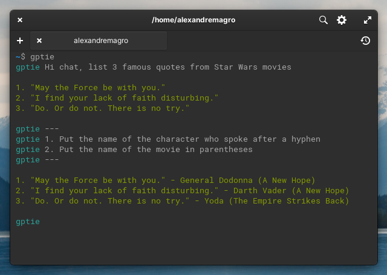

# GPTie

User-friendly command-line client for the ChatGPT.

## Installation

- Install:

```shell
npm install -g gptie
```

- Generate the API key from the OpenAI dashboard
- Set the API key as the `OPENAI_API_KEY` environment variable


## Basic Usage

<p align="center">
  
</p>

## Arguments

- `-q` - Query mode

```
$ gptie -q "how old is the universe?"
```

- `d` - Override block delimiter

```
$ gptie -d "==="
> ===
> Find the bug in the code below (Ruby)
>
> put "Hello World"
> ===
```

## Configuration

- `OPENAI_API_KEY`: OpenAI API key (*required)
- `OPEN_API_MODEL`: Specify GPT model in OpenAI (default is 'gpt-3.5-turbo')
- `GTPIE_BLOCK_DELIMITER`: Define block delimiter (default is '---')
- `GPTIE_MESSAGES_MAX_SIZE`: Define the max number of messages send on request payload
  (default is '16')

## License

[MIT](http://opensource.org/licenses/MIT)

Copyright (c) 2017-present, Alexandre Magro
